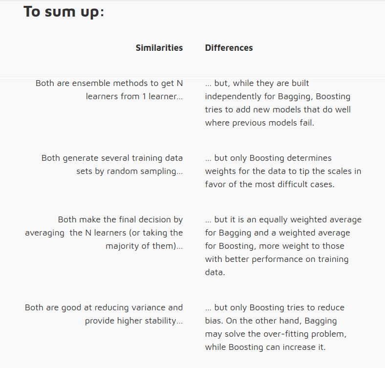
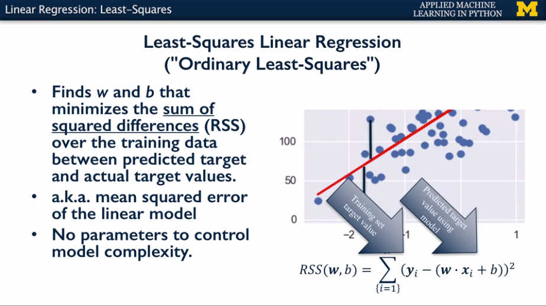
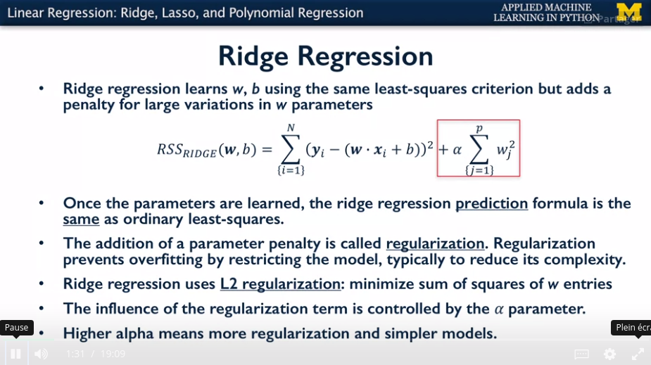
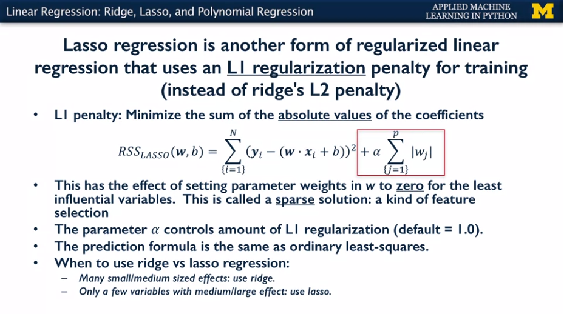
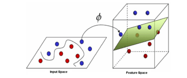
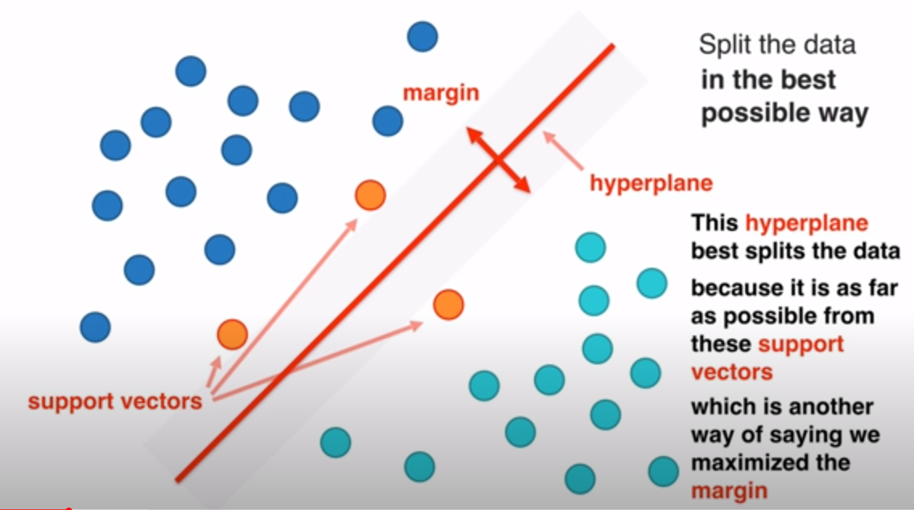
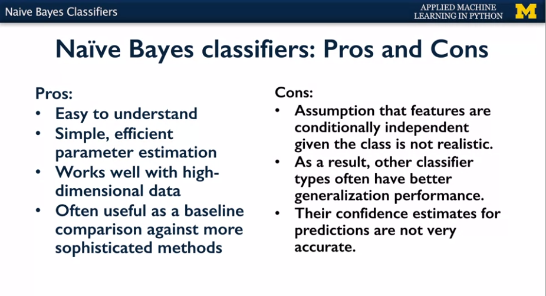
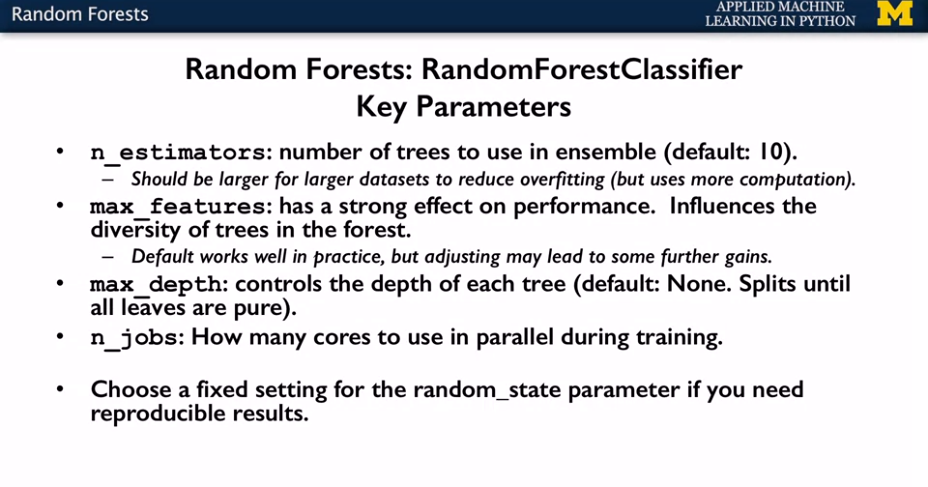
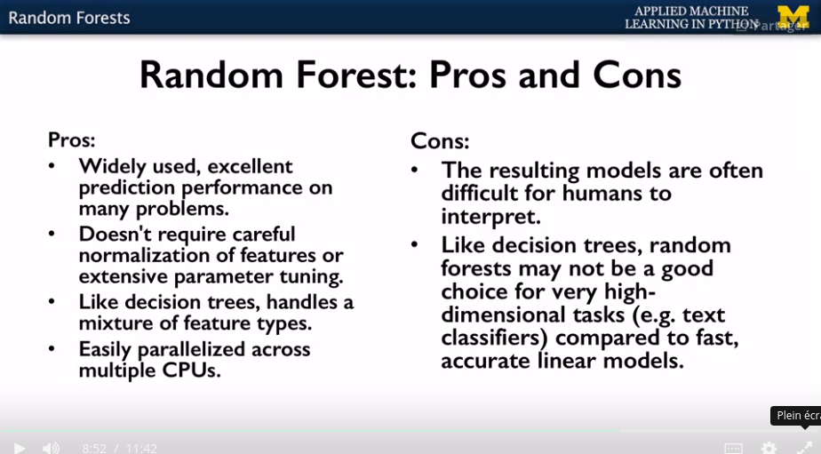
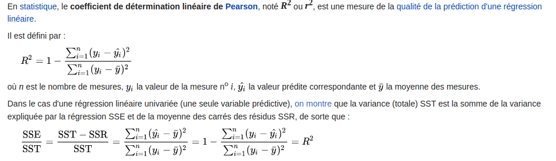

http://martin.zinkevich.org/rules_of_ml/rules_of_ml.pdf

https://medium.com/@taylor.mark110/data-science-certifications-the-best-picks-for-2021-1d1023ce8eed

Roadmap to become a datascientist : 
https://tekrajawasthi15.medium.com/the-complete-roadmap-to-be-a-data-scientist-9a07721b88fd

tips to find a job : 
https://towardsdatascience.com/how-i-got-4-data-science-offers-and-doubled-my-income-2-months-after-being-laid-off-b3b6d2de6938

GCP:
https://ml-rafiqhasan.medium.com/how-i-cracked-the-gcp-professional-ml-engineer-certification-in-8-days-f341cf0bc5a0

# **Cross Validation**

La validation croisée (ou cross-validation  en anglais) est une méthode statistique qui permet d'évaluer la capacité de généralisation d'un modèle. Il s'agit d'une méthode qui est plus stable et fiable que celle d'évaluer la performance sur des données réservées pour cette tache (Hold-out Validation). Généralement lorsqu'on parle de cross-validation (cv), l'on réfère à sa variante la plus populaire qu'est le k-fold cross-validation. Dans ce cas, nous profitons de toutes les données à disposition en les divisant en k parties égales (folds) sur lesquelles on entraîne et teste un modèle pendant k itérations. A chaque itération, le modèle est entrainé sur k-1 folds et est testé sur le fold restant

https://www.kevindegila.com/la-validation-croisee-en-machine-learning-tout-ce-quil-faut-savoir/

# **Bias–variance tradeoff** : 

## **Error due to Bias**: 
The error due to bias is taken as the difference between the expected (or average) prediction of our model and the correct value which we are trying to predict. Of course you only have one model so talking about expected or average prediction values might seem a little strange. However, imagine you could repeat the whole model building process more than once: each time you gather new data and run a new analysis creating a new model. Due to randomness in the underlying data sets, the resulting models will have a range of predictions. Bias measures how far off in general these models' predictions are from the correct value.

## **Error due to Variance**: 
The error due to variance is taken as the variability of a model prediction for a given data point. Again, imagine you can repeat the entire model building process multiple times. The variance is how much the predictions for a given point vary between different realizations of the model.

## semi automated data exploration

https://towardsdatascience.com/semi-automated-exploratory-data-analysis-eda-in-python-7f96042c9809

# **Algo** 

## **Boosting and Bagging**

https://www.lovelyanalytics.com/2016/09/12/gradient-boosting-comment-ca-marche/#:~:text=Le%20principe%20du%20Boosting&text=Dans%20la%20construction%20des%20mod%C3%A8les,la%20performance%20de%20la%20pr%C3%A9diction.

## **Regression**
     
### **linear regression** 

https://coursera.org/share/dc8d642a878feedbe80b1e97c9436145

### **polynamial regression** 
Polynomial regression is not really a proper model but it's just a linear regression  with polynamial transformation on this features
https://towardsdatascience.com/polynomial-regression-bbe8b9d97491

### **ridge regression**
La régression ridge nous permet de réduire l'amplitude des coefficients d'une régression linéaire et d'éviter le sur-apprentissage.
https://www.youtube.com/watch?v=oh4PNaT5s3c&ab_channel=Science4All
https://www.youtube.com/watch?v=Q81RR3yKn30&ab_channel=StatQuestwithJoshStarmer
https://openclassrooms.com/fr/courses/4444646-entrainez-un-modele-predictif-lineaire/4507806-reduisez-le-nombre-de-variables-utilisees-par-votre-modele

https://developers.google.com/machine-learning/crash-course/regularization-for-simplicity/l2-regularization?hl=fr

### **lasso regression** 
Il s'agit donc d'une méthode de sélection de variables et de réduction de dimension supervisée : les variables qui ne sont pas nécessaires à la prédiction de l'étiquette sont éliminées.

Attention : 
Si plusieurs variables corrélées contribuent à la prédiction de l'étiquette, le lasso va avoir tendance à choisir une seule d'entre elles (affectant un poids de 0 aux autres), plutôt que de répartir les poids équitablement comme la régression ridge. C'est ainsi qu'on arrive à avoir des modèles très parcimonieux. Cependant, laquelle de ces variables est choisie est aléatoire, et peut changer si l'on répète la procédure d'optimisation. Le lasso a donc tendance à être instable.

https://openclassrooms.com/fr/courses/4444646-entrainez-un-modele-predictif-lineaire/4507806-reduisez-le-nombre-de-variables-utilisees-par-votre-modele

https://developers.google.com/machine-learning/crash-course/regularization-for-sparsity/l1-regularization?hl=fr

### **elasticnet regression** 
L'elastic net combine les normes ℓ1 et ℓ2( ridge et lasso) pour obtenir une solution moins parcimonieuse que le lasso, mais plus stable et dans laquelle toutes les variables corrélées pertinentes pour la prédiction de l'étiquette sont sélectionnées et reçoivent un poids identique.
Le lasso peut donc être utilisé comme un algorithme de réduction de dimension supervisée.
https://openclassrooms.com/fr/courses/4444646-entrainez-un-modele-predictif-lineaire/4507806-reduisez-le-nombre-de-variables-utilisees-par-votre-modele

## **Classification** 

### **Kernel trick** 
    appliquer une transformation sur ses données pour qu'elle soit linéairement séparable.
    https://www.youtube.com/watch?v=tpNs-Hz6-LM
     Ces fonctions mathématiques permettent de séparer les données en les projetant dans un feature space (un espace vectoriel de plus grande dimension, voir figure ci-dessous)

# **SVM**

https://dataanalyticspost.com/Lexique/svm/
https://www.youtube.com/watch?v=N1vOgolbjSc&ab_channel=AliceZhao
https://www.youtube.com/watch?v=Y6RRHw9uN9o&ab_channel=AugmentedStartups

 leur principe est simple : il ont pour but de séparer les données en classes à l’aide d’une frontière aussi « simple » que possible, de telle façon que la distance entre les différents groupes de données et la frontière qui les sépare soit maximale. Cette distance est aussi appelée « marge » et les SVMs sont ainsi qualifiés de « séparateurs à vaste marge », les « vecteurs de support » étant les données les plus proches de la frontière.

En résumé : cherche à trouver la plus large marge en les vecteursde supports par l'interédiaire d'un probème d'optimisation sous contrainte (lagrange multipliers technique)

Hyper-paramêtr à retenir : 
C qui permet de décider de la pénalité des missclassifications. Un low C pourra permettre certains erreurs de classification mais une meilleur généralisation ( higher bias but lower variance?) un High C ne permettra pas d'erreur de classification (low bias, high variance)
dans le cas du kernal radial basis: alpha déterine la complexité du kernel et donc du modèle.

### **Naives bayes classifier**
- Naîve car considère que toutes les variables sont indépendantes (littlle/ no correlation) et de même importance
- PLusieurs types : 
  - Bernouilli : Le modèle Bernoulli Naive Bayes utilise un ensemble de caractéristiques d'occurrence binaires. Lors de la classification des textes par exemple, le modèle Bernoulli Naive Bayes est très pratique car nous pourrions représenter la présence ou l'absence du mot donné dans le texte avec la fonction binaire.
  - Multinomial : utilise un ensemble de fonctions de base de nombre dont chacune tient compte du nombre de fois qu'une caractéristique particulière telle qu'un mot est observée dans un exemple de formation comme un document.
ces modèles sont particulièrement adaptés aux données textuelles, où chaque entité correspond à une observation pour un mot particulier

  - Gaussian : continuous/real-valued features : Nous allons chercher à déterminer la probabilité que notre objet appartient à la classe “écrit romanesque” à la probabilité que notre écrit appartient à l’autre classe.
  Nous allons ensuite comparer ces deux probabilités pour sélectionner la plus grande des deux.
  En résumant cherche à calculer les probabiltés conditionneles d'appartenances à chaques classes grâce à la formule de bayes et séléctionne la probabilté la plus importante
  ( sachant que mes features ont les valeurs a,b,c quelle est la probabilté d'appartenir à cette classe)

  
  
### **decision tree**

- complexification à l'infini 
- Très peu couteux
-  parfois du mal à généraliser
- se généralise parfaitement au très grand dimension
- très rapidemment calculable
- MAIS gros risuqe d'overfitting (l'arbre peut s'agrandir jusqu'a matcher parfaitement les données)
https://www.youtube.com/watch?v=D2IazsNG9_g&list=PLtzmb84AoqRTl0m1b82gVLcGU38miqdrC&index=17&ab_channel=Science4All

### **random forest** 
ensemble d'arbre de décision (chaque arbre est différent étant données que la racine est différente)
le but étant de faire assez d'arbre pour être résistant aux fluctuations des données et limiter la variance
https://www.youtube.com/watch?v=D2IazsNG9_g&list=PLtzmb84AoqRTl0m1b82gVLcGU38miqdrC&index=17&ab_channel=Science4All

### **Gradient boosting classifier**

### **logistic Regression**

## **Neural Network**
http://playground.tensorflow.org/#activation=tanh&batchSize=7&dataset=xor&regDataset=reg-plane&learningRate=0.03&regularizationRate=0&noise=0&networkShape=8,7&seed=0.85256&showTestData=false&discretize=false&percTrainData=30&x=true&y=true&xTimesY=false&xSquared=false&ySquared=false&cosX=false&sinX=false&cosY=false&sinY=false&collectStats=false&problem=classification&initZero=false&hideText=false
## **anomaly detection**
### Introduction 

https://medium.com/sciforce/anomaly-detection-another-challenge-for-artificial-intelligence-c69d414b14db

### ***build an anomaly detection model***

https://towardsdatascience.com/wondering-how-to-build-an-anomaly-detection-model-87d28e50309

with classification and gaussian distribution

## **Clustering**

### DBSCAN (density-based spatial clustering of applications with noise)
https://pub.towardsai.net/fully-explained-dbscan-clustering-algorithm-with-python-a568139ebff5
### **Random Cut Forest**
https://freecontent.manning.com/the-randomcutforest-algorithm/
https://opendistro.github.io/for-elasticsearch/blog/odfe-updates/2019/11/random-cut-forests/
https://docs.aws.amazon.com/quicksight/latest/user/what-is-random-cut-forest.html

STREAMING ALGO
The machine learning algorithm you’ll use in this article is called Random Cut Forest. It’s a wonderfully descriptive name because the algorithm takes a bunch of random data points (Random), cuts them to the same number of points and creates trees (Cut). It then looks at all of the trees together (Forest) to determine whether a particular data point is an anomaly: Random Cut Forest.

# **Scoring**

## **GLOBAL**
    https://scikit-learn.org/stable/modules/model_evaluation.html

## **Classification** :

### **Confusion matrix** 
### Accuracy 
TP + TN / (TP + TN + FP + FN)
### Precision
TP / (TP + FP)
### Recall
TP / (TP + FN)  Also known as sensitivity, or True Positive Rate
### F1
2 * Precision * Recall / (Precision + Recall) 

https://towardsdatascience.com/confusion-matrix-for-your-multi-class-machine-learning-model-ff9aa3bf7826

### ROC and AUC (PR and ): 
https://developers.google.com/machine-learning/crash-course/classification/roc-and-auc?hl=fr#:~:text=An%20ROC%20curve%20(receiver%20operating,False%20Positive%20Rate

https://blog.octo.com/quel-sens-metier-pour-les-metriques-de-classification/#:~:text=Precision%2DRecall%20AUC%20(PR%20AUC)&text=Plus%20une%20courbe%20a%20un,la%20performance%20globale%20du%20classifieur.

## Regression :

### **R2**
R², ou R-carré est appelé coefficient de détermination, est utilisé surtout en statistiques pour juger de la qualité d’une régression linéaire

Weakness : https://freakonometrics.hypotheses.org/75

### **RMSE**
rmse_train = np.sqrt(mean_squared_error(Y_train, y_train_predicted))

## **AIC ou BIC**