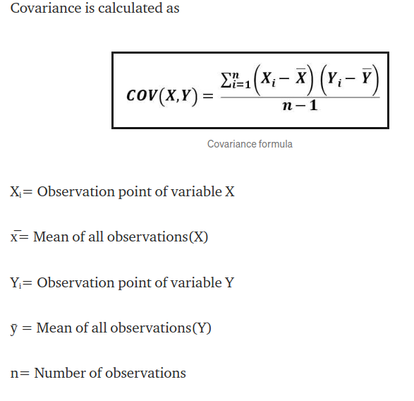
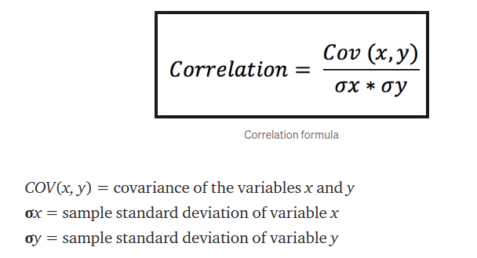
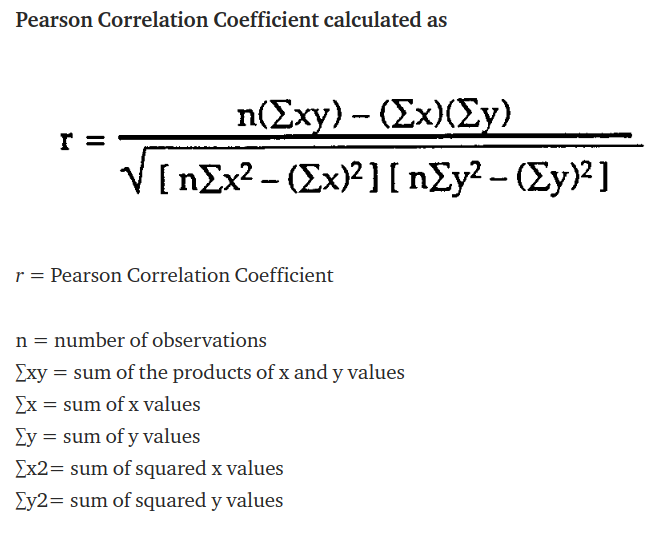
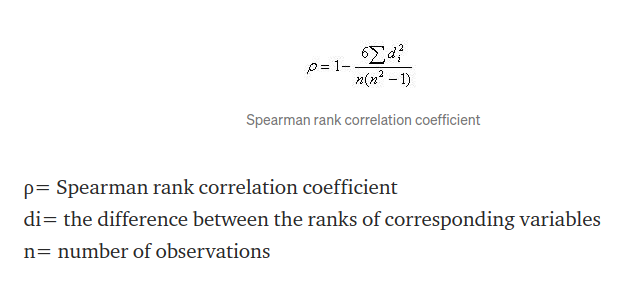

# Variance and standard deviation

Variance is a measure of the variation among values. It is calculated by adding up squared differences of each value and the mean and then dividing the sum by the number of samples.

Standard deviation is a measure of how spread out the values are. To be more specific, it is the square root of variance.

# Covariance and Correlation (Pearson/Spearman)

**Covariance**: The prefix ‘Co’ defines some kind of joint action and variance refers to the change or variation. So it says, two variables are related based on how these variables change in relation with each other.
But wait, is covariance same as correlation?
As covariance says something on same lines as correlation, correlation takes a step further than covariance and also tells us about the strength of the relationship.
Both can be positive or negative. Covariance is positive if one increases other also increases and negative if one increases other decreases.

**Correlation**:

Correlation is a normalization of covariance by the standard deviation of each variable.

*Pearson Correlation Coefficient*
captures the strength and direction of the linear association between two continuous variables. It tries to draw the line of best fit through the data points of two variables. Pearson correlation coefficient indicates how far these data points are away from the line of best fit. The relationship is linear only when the change in one variable is proportional to the change in another variable.

*Spearman’s Correlation Coefficient*
tries to determine the strength and the direction of the monotonic relationship which exists between two ordinal or continuous variables. In a monotonic relationship two variables tend to change together but not with the constant rate. It’s calculated on the ranked values of the variables rather than on the raw data.

Pearson correlation describes linear relationships and spearman correlation describes monotonic relationships.

# Central limit theorem

In many fields including natural and social sciences, when the distribution of a random variable is unknown, normal distribution is used.
Central limit theorem (CLT) justifies why normal distribution can be used in such cases. According to the CLT, as we take more samples from a distribution, the sample averages will tend towards a normal distribution regardless of the population distribution.
Consider a case that we need to learn the distribution of the heights of all 20-year-old people in a country. It is almost impossible and, of course not practical, to collect this data. So, we take samples of 20-year-old people across the country and calculate the average height of the people in samples. CLT states that as we take more samples from the population, sampling distribution will get close to a normal distribution.
Why is it so important to have a normal distribution? Normal distribution is described in terms of mean and standard deviation which can easily be calculated. And, if we know the mean and standard deviation of a normal distribution, we can compute pretty much everything about it.

fr : 
établit la convergence en loi de la somme d'une suite de variables aléatoires vers la loi normale. Intuitivement, ce résultat affirme qu'une somme de variables aléatoires identiques et indépendantes tend (le plus souvent) vers une variable aléatoire gaussienne

#  P-value

La valeur de p est souvent utilisée dans les tests d'hypothèses, tests qui vous permettent de rejeter, ou non, une hypothèse nulle. Elle représente la probabilité de faire une erreur de type 1, ou de rejeter l'hypothèse nulle si elle est vraie.

Plus la valeur de p est petite, plus la probabilité de faire une erreur en rejetant l'hypothèse nulle est faible. Une valeur limite de 0,05 est souvent utilisée. Autrement dit, vous pouvez rejeter l'hypothèse nulle si la valeur de p est inférieure à 0,05.

https://www.youtube.com/watch?v=jy9b1HSqtSk&ab_channel=Science4All
https://www.youtube.com/watch?v=xVIt51ybvu0&ab_channel=Lastatistiqueexpliqu%C3%A9e%C3%A0monchat

Principe de réfutation : 

H0 hypothèse nulle et l'hypothèse à refuter ou T 
La science cherche à collecter des données D pour réfuter la théories T

résumé vidéo science4All:

Réfutation de fisher 
si les données D sont hautement invraisemblable (en queue de distrib) en supposant T vrai alors on rejette T
autrement dit si la p-value ( vraissemblance des données D ) est très faible alors on doit rejeter T

les sciences consisterait donc à réfuter des théories qui sont vraissemblablement réfutable. EN science on ne prouve pas les théroies on les réfute

 
Souvent T décrit une quasi loi normale, les données D vont donc décrire une courbe en cloche
 on dit alors que T est vraisemblable si D se trouve dans la cloche et T est rejeté si D se trouve au extréite (queues de distriubtions)

La p-value est donc la vraissemblance des données "pires" que D en supposant T vraie

exemple de compréhension :
les physiciens ont découvert le boson de higgs à 99.9999% de chance == Faux 
Si on suppose l'absence du boson de higgs (H0, T est vrai) alors la vraissemblance des données plus incompatible avec l'abence du boson de higgs que la donné D observé par le CERN est inférieur à 0,0001 
Donc si on applique la méthode de fishe (p-value) alors il faut rejeter l'absence du boson de higgs*

théorème de la p-value : 
Si T es est vraie le seuil de la p-value est égale à la probabilité de rejeter T à tort

si la science testait ses théories avec un seuil de 1% alors 1% des thérories serait erronés 

p-valuen'esplique ps tout : la vraissemblance des donées n'est pas la crédence de la théorie

# Compromis biais-variance 

# Confidence intervalue 
# Bayesian analysis
# Expected value of random variables

# Conditional probability 

# Bayes’ theorem